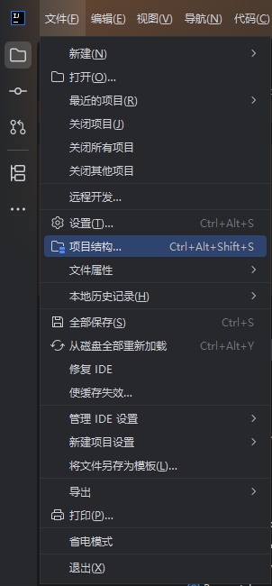
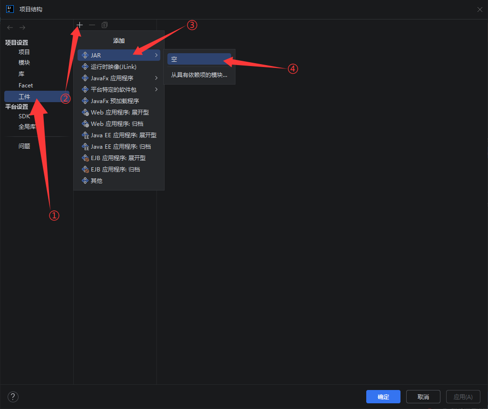
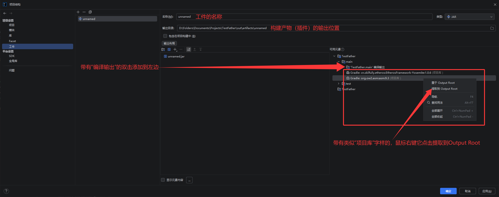
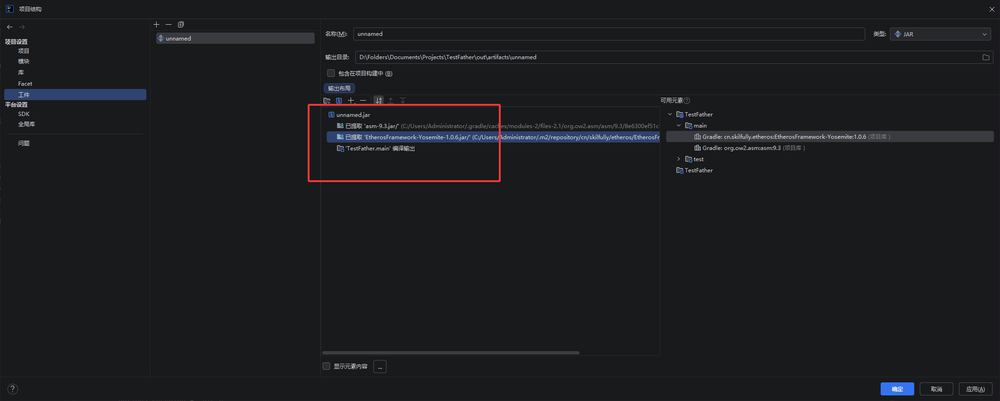
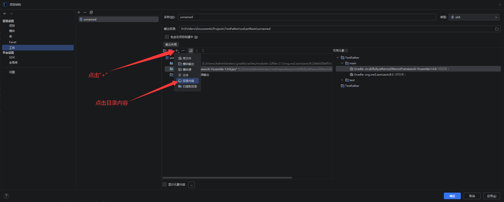
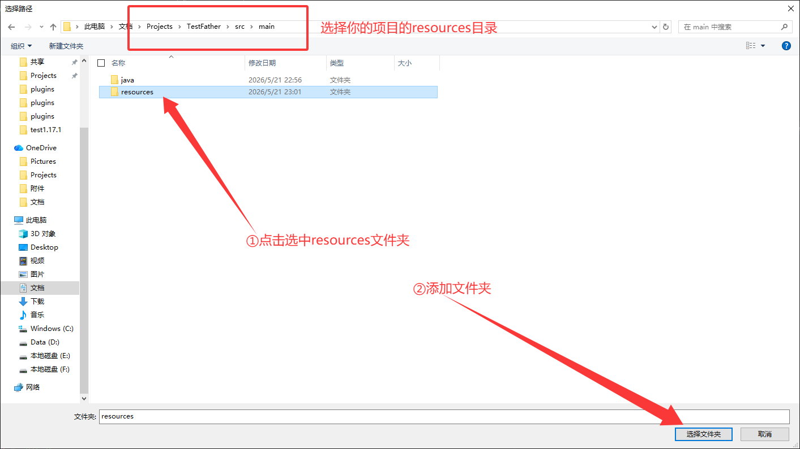
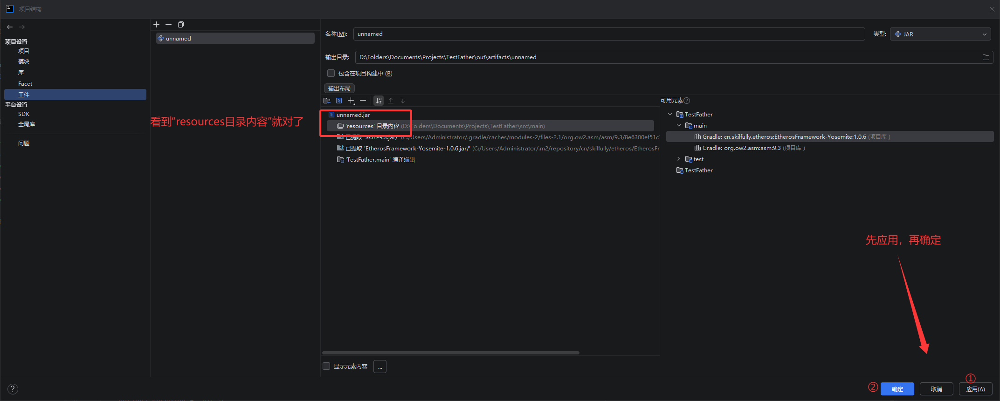
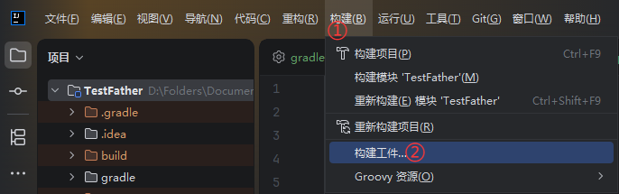
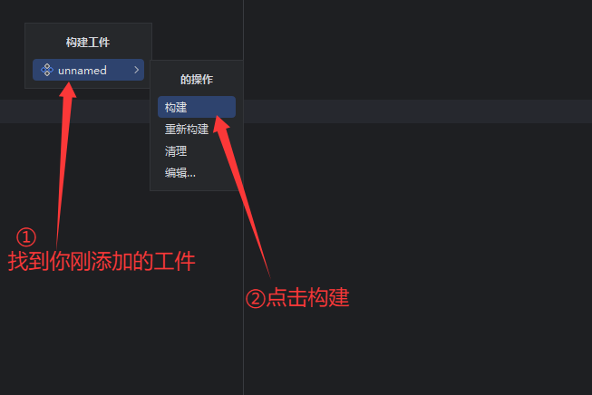
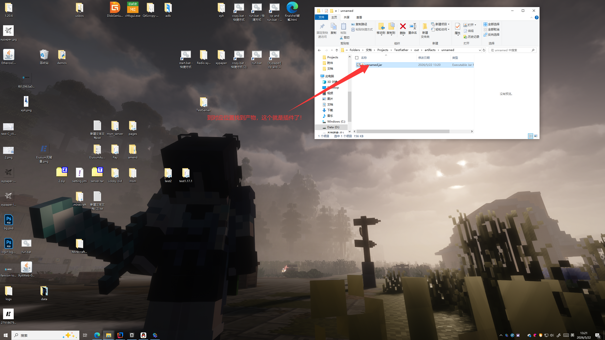

# 构建插件产物

***这里以 IDEA 为例***

> 点击IDE左上角 `文件` 中的 `项目结构`\
> 

> 点击 `工件` > 上方 `+` > `JAR` > `空`\
> 

> 根据自己的需求来配置工件\
>  ⚠注意要把 `编译输出` **双击添加到左边**，`项目库` 右键 `提取到 Output Root`
> 

> 正确情况如图：\
> 

> 点击 `+` > `目录内容`\
> 

> 选择你的项目的 `resources` 目录并确定\
> 

> 正确情况如图，现在可以保存了\
> 

> 点击菜单栏 `构建` > `构建产物`\
> 

> 选择你刚刚保存的工件，点击 `构建` 即可开始构建产物（你的插件）\
> 

> 输出产物在刚才第三张图片中的 `输出目录`\
> 这个文件就是你的插件了，把他丢到plugins里运行服务端试试吧！\
> 